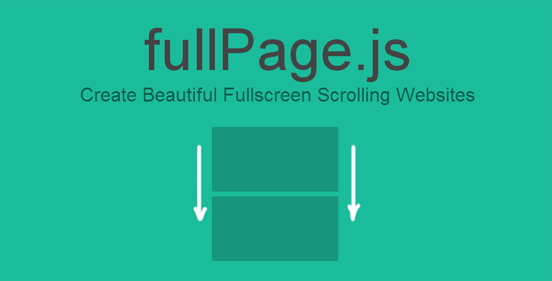

# Ember-cli-fullpagejs



这是对 [fullPage.js](https://github.com/alvarotrigo/fullPage.js) 的封装，实现非常酷炫的翻页效果。

* [demo](http://ebookchain.org)
* [开发文档（Document)]()
* [使用文档](./README_zh_CN.md)

## Installation

If you are using Ember CLI 0.2.3 or higher, just run within your project directory:

```bash
ember install ember-cli-fullpagejs --save-dev
```

If your Ember CLI version is greater than 0.1.5 and less than 0.2.3, run the following within your project directory:

```bash
ember install:addon ember-cli-fullpagejs
```

When your Ember CLI version is below 0.1.5, please run within your project directory:

```bash
npm install --save-dev ember-cli-fullpagejs
ember generate ember-cli-fullpagejs
```

## Usage

You only use the tag `{{#full-page}}{{/full-page}}` instead of `<div id="fullpage"></div>` in your template files, others are the same as using fullPage.js.

#### （1）**Required HTML structure**

```
{{#full-page}}
    <div class="section">Some section</div>
    <div class="section">Some section</div>
    <div class="section">Some section</div>
    <div class="section">Some section</div>
{{/full-page}}
```

In order to create a landscape slider within a section, each slide will be defined by default with an element containing the slide class:

```
<div class="section">
    <div class="slide"> Slide 1 </div>
    <div class="slide"> Slide 2 </div>
    <div class="slide"> Slide 3 </div>
    <div class="slide"> Slide 4 </div>
</div>
```

#### （2）**Options**

You can add an option in the tag, ex:

```html
{{#full-page autoScrolling='true' navigation='true' anchors='["firstPage", "secondPage"]' }}

{{/full-page}}
```

**Note**: The value of the option has to be wrapped by Single quotation mark `'` instead of Double quotation marks `"`.

All of the options are the following, you can [read more](https://github.com/alvarotrigo/fullPage.js#options):

```
//Navigation
menu: '#menu',
lockAnchors: false,
anchors:['firstPage', 'secondPage'],
navigation: false,
navigationPosition: 'right',
navigationTooltips: ['firstSlide', 'secondSlide'],
showActiveTooltip: false,
slidesNavigation: true,
slidesNavPosition: 'bottom',

//Scrolling
css3: true,
scrollingSpeed: 700,
autoScrolling: true,
fitToSection: true,
fitToSectionDelay: 1000,
scrollBar: false,
easing: 'easeInOutCubic',
easingcss3: 'ease',
loopBottom: false,
loopTop: false,
loopHorizontal: true,
continuousVertical: false,
continuousHorizontal: false,
scrollHorizontally: false,
interlockedSlides: false,
resetSliders: false,
fadingEffect: false,
normalScrollElements: '#element1, .element2',
scrollOverflow: false,
scrollOverflowOptions: null,
touchSensitivity: 15,
normalScrollElementTouchThreshold: 5,
bigSectionsDestination: null,

//Accessibility
keyboardScrolling: true,
animateAnchor: true,
recordHistory: true,

//Design
controlArrows: true,
verticalCentered: true,
sectionsColor : ['#ccc', '#fff'],
paddingTop: '3em',
paddingBottom: '10px',
fixedElements: '#header, .footer',
responsiveWidth: 0,
responsiveHeight: 0,
responsiveSlides: false,

//Custom selectors
sectionSelector: '.section',
slideSelector: '.slide',

//events
onLeave: function(index, nextIndex, direction){},
afterLoad: function(anchorLink, index){},
afterRender: function(){},
afterResize: function(){},
afterSlideLoad: function(anchorLink, index, slideAnchor, slideIndex){},
onSlideLeave: function(anchorLink, index, slideIndex, direction, nextSlideIndex){}
```

## Developing

* `git clone` this repository
* `npm install`
* `bower install`

## Running

* `ember server`
* Visit your app at http://localhost:4200.

## Running Tests

* `npm test` (Runs `ember try:testall` to test your addon against multiple Ember versions)
* `ember test`
* `ember test --server`

## Building

* `ember build`

For more information on using ember-cli, visit [http://ember-cli.com/](http://ember-cli.com/).
